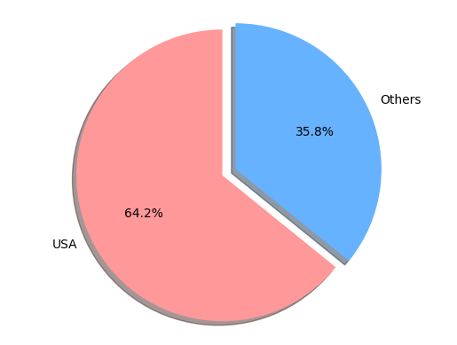

# CobaltParser
 ## Cobalt Strike Log parser input and output
 ### Current build [download](https://github.com/lartsev1337/Cobalt-Strike-Parser/releases/download/parser/CobaltParser.exe)
 Specify the folder where the beacon*.log logs are collected, the program will start searching for files recursively in this folder and its subfolders.

 

 As a result, in the folder we specified, a CSV file will be created with the following columns:
 
 | Metadata | MetaTime | HackerNickname | InputTime | InputCommand | Task | Output/ErrorTime | Output/ErrorResult |
 |:--------:|:--------:|:--------:|:--------:|:--------:|:--------:|:--------:|:--------:|
 | 0.0.0.0 <- 0.0.0.0 ... ... | 13/31 12:12:12 | debil | 13/31 13:13:13 | run net group "domain admins" \/dom | <T1059> Tasked beacon to run: net group "domain admins" \/dom| 13/31 14:14:14 | easy-peasy |


 + Metadata - information about the connection and module

 + MetaTime - start time
 
 + HackerNickname - hacker's nickname
 
 + InputTime - time of command issuance
 
 + InputCommand - command
 
 + Task - task
 
 + Output/ErrorTime - execution time and response time
 
 + Output/ErrorResult - response to the hacker
 
# CSV analyzer in Jupyter
```python
import pandas as pd
import re
import geoip2.database
import matplotlib.pyplot as plt

data = pd.read_csv('Export.csv')
geo = geoip2.database.Reader('GeoLite2-Country.mmdb')

def extract_ip(s):
    if not isinstance(s, str):
        return None
    match = re.search(r"\b\d{1,3}\.\d{1,3}\.\d{1,3}\.\d{1,3}\b", s)
    return match.group(0) if match else None

def extract_computer_name(s):
    if not isinstance(s, str):
        return None
    pattern = r'computer:\s(\w+)'
    match = re.search(pattern, s)
    return match.group(1) if match else None

def extract_internal_ip(s):
    if not isinstance(s, str):
        return None
    pattern = r'(?<=<-\s)(\d{1,3}\.\d{1,3}\.\d{1,3}\.\d{1,3})'
    match = re.search(pattern, s)
    return match.group(0) if match else None

data['External_IP'] = data['Metadata'].apply(extract_ip)
data['Internal_IP'] = data['Metadata'].apply(extract_internal_ip)
data['CompName'] = data['Metadata'].apply(extract_computer_name)

unique_ips = data['External_IP'].drop_duplicates()

countries = {}
for ip in unique_ips:
    try:
        response = geo.country(ip)
        countries[ip] = response.country.iso_code
    except Exception as e:
        countries[ip] = "Unknown"

```

### Retrieving all entries related to the USA
```
total_records = len(countries)
us_records = list(countries.values()).count('US')

country_counts = {}

for country in countries.values():
    if country in country_counts:
        country_counts[country] += 1
    else:
        country_counts[country] = 1

keys = list(country_counts.keys())
values = list(country_counts.values())

```

### In terms of percentage...
```python
all_us = us_records / total_records * 100
```

### Plotting a graph based on these data
```python
labels = ['USA', 'Others']
sizes = [all_us, 100-all_us]
colors = ['#ff9999','#66b2ff']
explode = ( 0, 0.1 )
fig1, ax1 = plt.subplots()
ax1.pie(sizes, explode=explode, labels=labels, colors=colors, autopct='%1.1f%%',
        shadow=True, startangle=90)
ax1.axis('equal')
plt.show()
```


   
### Trying to filter entries by external IP
```python
filtered_data = data[data['External_IP'].fillna('').str.startswith("50.205.")]
```

### Trying to filter the data by part of the computer name
```python
filtered_data = filtered_data[filtered_data['CompName'].fillna('').str.startswith("LAPTOP")]
```
